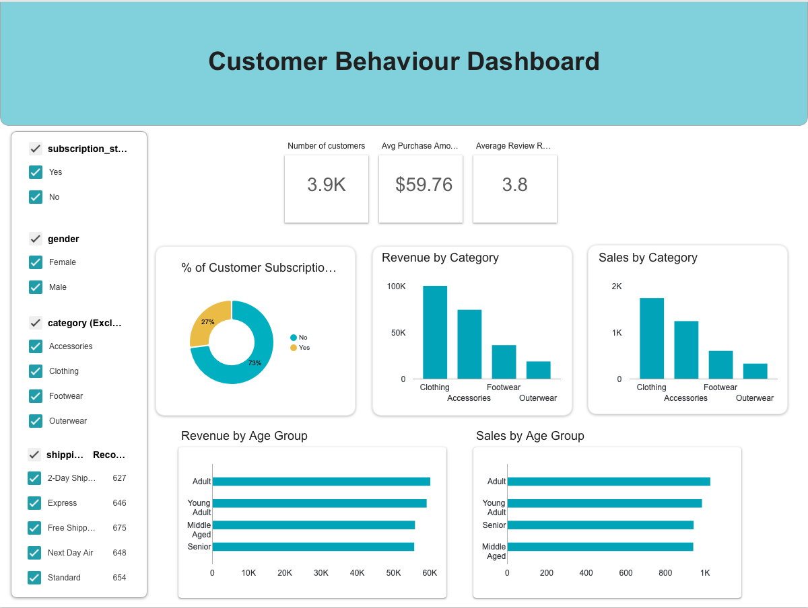

# 👨🏻‍💻 Customer Behavior Data Analyst Portfolio Project

This project is an analysis on customer shopping behaviour including all stages of data analysis: data preparation, feature engineering, using queries for gaining insights, visualisation and reporting.

## Problem Statement
A leading retail company wants to better understand its customers' shopping
behavior in order to improve sales, customer satisfaction, and long-term loyalty.
The management team has noticed changes in purchasing patterns across demographics, product categories, and sales channels (online vs offline).
They are particularly interested in uncovering which factors, such as 

- discounts, 
- reviews, 
- seasons, 
- payment preferences, 

drive consumer decisions and repeat purchases.

You are tasked with analyzing the company's consumer behaviour dataset to answer the following overaching business questions: 

**"How can the company leverage consumer shopping data to identify trends, improve customer engagement, and optimize marketing and product strategies?"**

## 🛠️ Tools Used

- **Python**: Used for data wrangling and EDA

- **SQL**: Main tool for analysis, running queries to gain insights

- **PostgreSQL**: The chosen management system, ideal for handling the customer behaviour data

- **Visual Studio Code**: Used as the main environment

- **Looker Studio**: Creation of interactive dashboard with main insights for data-based decision making

- **Gamma**: For creating and editing a presentation with the results

- **Git & GitHub**: For version control and sharing the SQL scripts and analysis, ensuring project tracking.

## 🚀 Workflow and setting up

**Prerequisites**

Create and activate a virtual environment, then install dependencies: 

```bash
python -m venv.venv
source .venv/bin/activate
pip install -r requirements.txt
```


1. Clone or download the project files
2. Clean the raw data from the [customer_shopping_behavior.csv](data/raw/customer_shopping_behavior.csv) using a Jupyter Notebook and Python
3. Create a database in pgAdmin4 and load the database in Postgres

    - For this you will need to update the credentials in the ```.env``` file with your own

    ```sh
    PGUSER= "username"
    PGPASSWORD= "password"
    PGHOST= "localhost"
    PGPORT="5432"
    PGDATABASE="customer_behaviour"
    ```

    - Load the database into SQL database running Python code

    - Create `sql_analysis.sql`
4. Run queries and analyse data
5. Use Looker Studio for visualization and creating a Dashboard

    


6. Reporting results in [Report](reports/[Report]customer_shopping_behaviour.pdf) and creating a relevant [Presentation](reports/[Presentation]customer_shopping_behaviour.pdf)


## Credits
This project was inspired by [Amlan Mohanty's](https://www.youtube.com/watch?v=5PrZvPeUw60) video tutorial.

